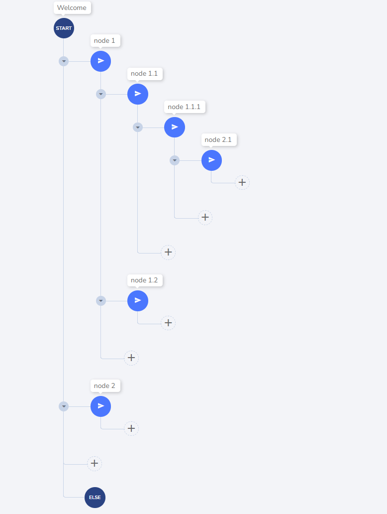
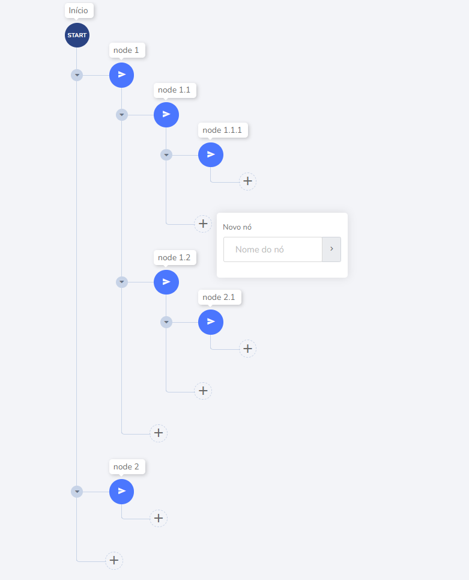

# Criação de Árvore

Este projeto tem como objetivo criar uma interface interativa de estrutura de árvore, onde cada nó pode ser movido para qualquer posição, seja acima de outro nó, no mesmo nível, em níveis diferentes ou como filho de outro nó. Abaixo está um exemplo de movimento do nó 2.1.

## Exemplo de Movimento de Nós

Após o movimento, o nó 2.1 deve ser posicionado como filho do nó 1.1.1.

## Adição de Novos Nós

Ao clicar no botão (+), deve aparecer uma opção para adicionar um novo nó, que deve ser posicionado exatamente onde o clique ocorreu.

## Restrição do Nó Principal

O nó "start" não pode ser movido, pois é o nó principal da árvore.

## Estrutura

O design e a estrutura da interface são de sua escolha. Utilize a estrutura que melhor se adapte ao cenário.

## Recursos Opcionais

- Implementar um nó bloqueado (marcado visualmente) que não pode ser arrastado/movido diretamente para outra posição.
- Caso de teste: Minimizar o grupo de nós. Observe o ícone de seta na árvore, que é responsável por minimizar todo o grupo de nós.

## Requisitos

- React com TypeScript
- O uso de bibliotecas fica a seu critério.

## Entrega

Conclua o projeto em até 5 dias após receber este teste.
Faça o upload do projeto no GitHub e envie o link por e-mail para daniel@botdesigner.io, com o assunto [Desenvolvedor React].